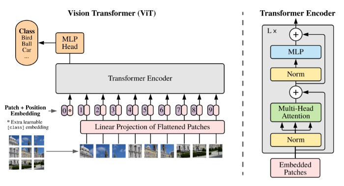

# VisionTransformer (Pytorch)
Stand alone implementation of Google's vision transformer.

**An image is worth 16x16 words: transformers for image recognition at scale:**
Find the original paper [here](https://arxiv.org/pdf/2010.11929.pdf).

  

## Acknowledgements
This implementation is influenced by [Phil Wang's implementation](https://github.com/lucidrains/vit-pytorch) with some variations in initializations and first path embeddings.

## Requirements
* Python 3.9+
* PyTorch
* PyTorch einops library.